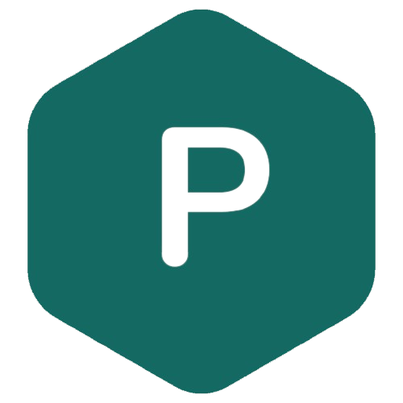
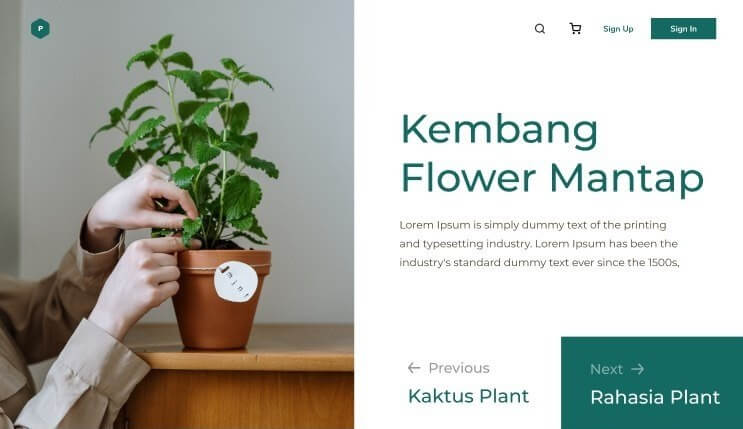

<!-- PROJECT SHIELDS -->
<p align="center">
  <a href="https://github.com/OleksandrZadvornyi/plant-shop-landing-page/graphs/contributors"></a>
  <a href="https://github.com/OleksandrZadvornyi/plant-shop-landing-page/network/members"></a>
  <a href="https://github.com/OleksandrZadvornyi/plant-shop-landing-page/stargazers"></a>
  <a href="https://github.com/OleksandrZadvornyi/plant-shop-landing-page/issues"></a>
  <a href="https://github.com/OleksandrZadvornyi/plant-shop-landing-page/blob/master/LICENSE"></a>
</p>

<!-- PROJECT LOGO -->
<br />
<div align="center">
  <a href="https://github.com/OleksandrZadvornyi/plant-shop-landing-page">
    
  </a>

  <h3 align="center">Plant Shop</h3>

  <p align="center">
    A modern, responsive landing page for an online plant shop
    <br />
    <a href="https://github.com/OleksandrZadvornyi/plant-shop-landing-page"><strong>Explore the docs »</strong></a>
    <br />
    <br />
    <a href="https://theplantshop.netlify.app">View Demo</a>
    ·
    <a href="https://github.com/OleksandrZadvornyi/plant-shop-landing-page/issues/new?labels=bug&template=bug-report---.md">Report Bug</a>
    ·
    <a href="https://github.com/OleksandrZadvornyi/plant-shop-landing-page/issues/new?labels=enhancement&template=feature-request---.md">Request Feature</a>
  </p>

  <p align="center">
    <a href="https://app.netlify.com/sites/theplantshop/deploys"></a>
  </p>
</div>

<!-- TABLE OF CONTENTS -->
## Table of Contents

- [Table of Contents](#table-of-contents)
- [About The Project](#about-the-project)
  - [Built With](#built-with)
- [Getting Started](#getting-started)
  - [Prerequisites](#prerequisites)
  - [Installation](#installation)
- [Development](#development)
  - [Available Scripts](#available-scripts)
  - [Code Formatting](#code-formatting)
- [Deployment](#deployment)
- [Contributing](#contributing)
- [Versioning](#versioning)
- [License](#license)
- [Contact](#contact)

<!-- ABOUT THE PROJECT -->
## About The Project

<div align="center">
  <br/>
  <a href="https://theplantshop.netlify.app/"></a>
  <br/><br/>
</div>

Plant Shop is a modern, responsive landing page for an online plant store. The design is based on this [Figma template](https://www.figma.com/file/r74vhd12rfrukxGazYRSkf/Plant-shop?node-id=0%3A1&mode=dev). The website showcases various plants available for purchase with a clean, minimalist design.

### Built With

This project emphasizes clean, vanilla web development practices:

- [![HTML][HTML]][HTML-url]
- [![CSS][CSS]][CSS-url]
- [![JS][JS]][JS-url]

Development tools:
- [Parcel](https://parceljs.org/) - Zero configuration build tool
- [Prettier](https://prettier.io/) - Code formatting
- [Standard Version](https://github.com/conventional-changelog/standard-version) - Versioning and changelog generation

## Getting Started

To get a local copy up and running, follow these steps:

### Prerequisites

- Node.js (version 18.0.0 or higher)
  ```sh
  node --version
  ```

### Installation

1. Clone the repository
   ```sh
   git clone https://github.com/OleksandrZadvornyi/plant-shop-landing-page.git
   ```
2. Install NPM packages
   ```sh
   npm install
   ```

## Development

### Available Scripts

- Start development server:
  ```sh
  npm start
  ```
- Build for production:
  ```sh
  npm run build
  ```
- Format code:
  ```sh
  npm run format
  ```
- Check code formatting:
  ```sh
  npm run format:check
  ```

### Code Formatting

This project uses Prettier for consistent code formatting. The formatting is automatically checked on pull requests through GitHub Actions. To ensure your code meets the formatting standards:

1. Format your code before committing:
   ```sh
   npm run format
   ```
2. Or enable format-on-save in your editor with the Prettier extension

## Deployment

The website is automatically deployed to [Netlify](https://www.netlify.com/) on every push to the master branch. You can view the live site at [theplantshop.netlify.app](https://theplantshop.netlify.app/).

## Contributing

1. Fork the Project
2. Create your Feature Branch (`git checkout -b feature/AmazingFeature`)
3. Commit your Changes (`git commit -m 'Add some AmazingFeature'`)
4. Push to the Branch (`git push origin feature/AmazingFeature`)
5. Open a Pull Request

Note: Pull requests are automatically checked for code formatting using Prettier.

## Versioning

This project uses [Standard Version](https://github.com/conventional-changelog/standard-version) for versioning and changelog generation. The version is automatically bumped and the changelog is generated on every push to master through GitHub Actions.

The workflow:
1. Automatically determines the next version based on commit messages
2. Updates package.json version
3. Generates/updates CHANGELOG.md
4. Creates a new git tag
5. Creates a GitHub release with changelog notes

## License

Distributed under the MIT License. See `LICENSE.txt` for more information.

## Contact

Oleksandr Zadvornyi - [@telegram](https://t.me/oleksandr_zadvornyi) - zadvornyi.alex16@gmail.com

Project Link: [https://github.com/OleksandrZadvornyi/plant-shop-landing-page](https://github.com/OleksandrZadvornyi/plant-shop-landing-page)

<!-- MARKDOWN LINKS & IMAGES -->
[HTML]: https://img.shields.io/badge/HTML-red?style=for-the-badge&logo=html5&logoColor=white
[HTML-url]: https://developer.mozilla.org/en-US/docs/Web/HTML
[CSS]: https://img.shields.io/badge/CSS-blue?&style=for-the-badge&logo=css3&logoColor=white
[CSS-url]: https://developer.mozilla.org/en-US/docs/Web/CSS
[JS]: https://img.shields.io/badge/JavaScript-yellow?style=for-the-badge&logo=javascript&logoColor=white
[JS-url]: https://developer.mozilla.org/en-US/docs/Web/JavaScript